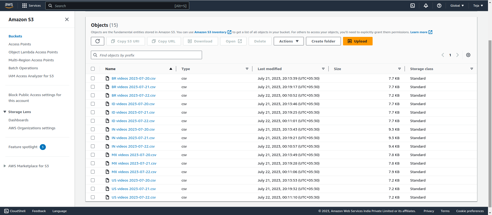

# YouTube Data Analysis Pipeline: From Extraction to Visualization

## Project Description:

 - Developed an end-to-end YouTube data pipeline using Python, AWS services, and Apache Airflow.
 - Goal: Collected YouTube data for the 5 countries with the most YouTube users - Brazil, India, Indonesia, Mexico, and the United States.
 - Pipeline collected data on a daily basis to ensure up-to-date information.
 - Utilized YouTube Data API to extract relevant data and loaded it into AWS S3.
 - Leveraged AWS Athena for data analysis through SQL-like queries.
 - Orchestrated the entire process using an Apache Airflow DAG.
 - Visualized analyzed data with Amazon QuickSight, delivering valuable insights for decision-making.
 - Demonstrated expertise in data engineering, cloud computing, and workflow automation.

## The data collected with the pipeline will be used to answer the following questions:

 - What are the most popular video categories in each country?
 - Does the most popular video category change over time? If so, how?
 - Number of videos uploaded over time.
 - 

## Architecture 

## The response of the API call contains information on up to 50 of the most popular videos in a given country at a given time. The raw data comes in a JSON format:

  {
    "kind": "youtube#videoListResponse",
    "etag": etag,
    "nextPageToken": string,
    "prevPageToken": string,
    "pageInfo": {
      "totalResults": integer,
      "resultsPerPage": integer
    },
    "items": [video Resource]
  }

## This transformation from JSON data to tabular data is summarized by the following:

## AirFlow DAG

## After Extraction of data from YouTube API the data is loaded into S3 as a .csv files

  

## Output data

## 

